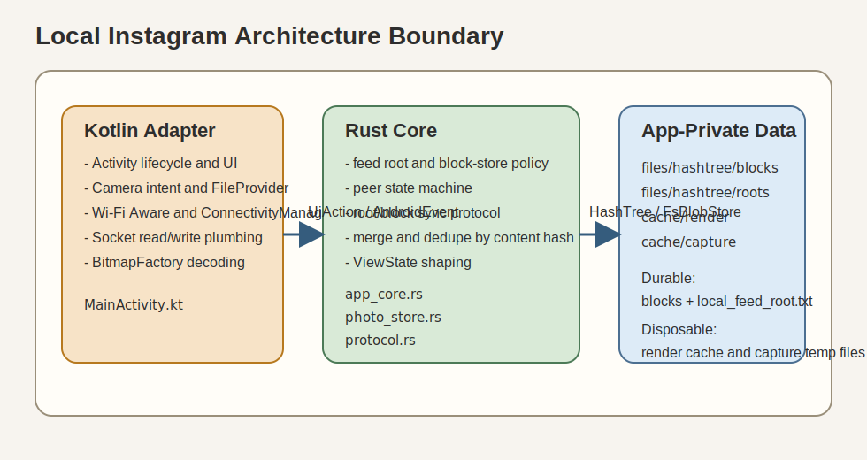
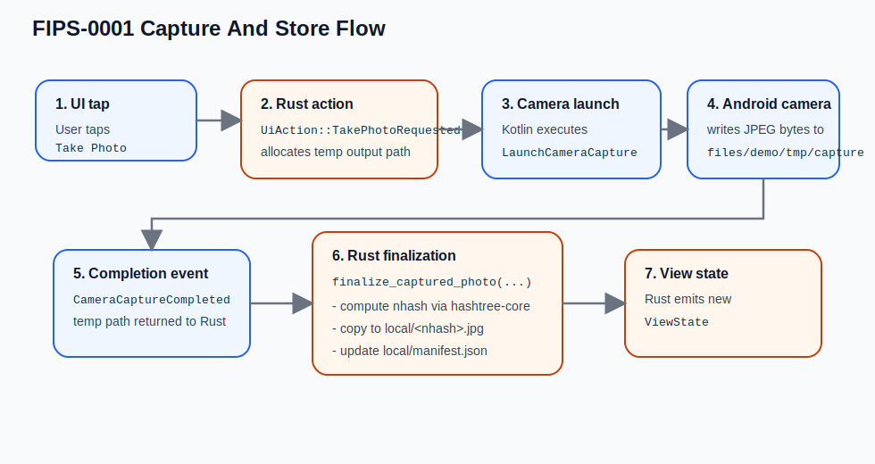
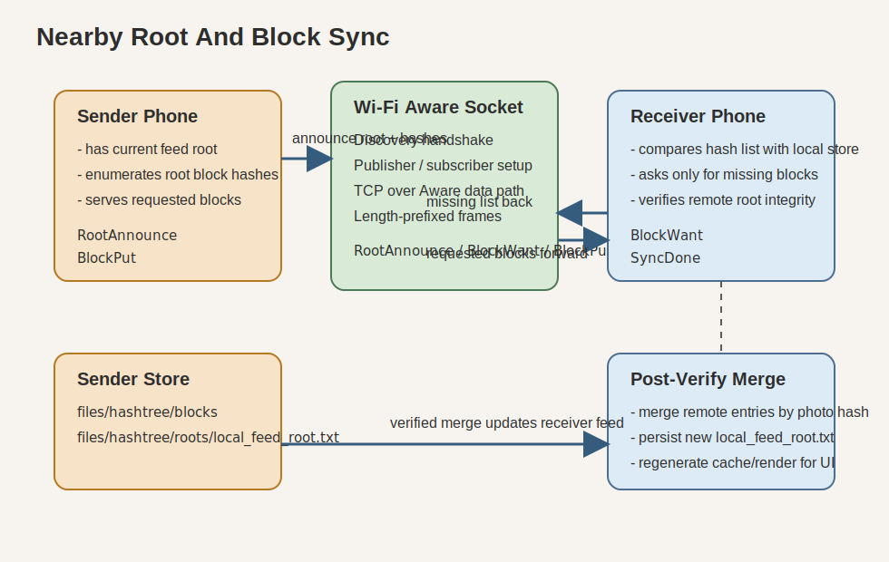

# FIPS-0001: Local Instagram Architecture

Status: Informational  
Version: 1  
Updated: 2026-04-02

## Abstract

This document describes the shipped architecture of `nostr-wifi-aware` as of the current `main` branch. The application is an Android-local photo sharing prototype with:

- camera-only capture
- app-private JPEG storage
- Rust-owned application logic
- Kotlin-owned Android integration
- Wi-Fi Aware peer transport
- per-file `nhash` verification using `hashtree-core`

The current design is intentionally narrow. It is a peer photo transfer demo, not yet a full persistent hashtree object store or social graph system.

## 1. System Boundary



The architecture is split into two layers:

- Kotlin adapter layer: Android-only objects and UI rendering
- Rust core layer: state machine, storage policy, protocol, and view-state shaping

The split is deliberate:

- Kotlin MUST own Android framework objects such as `WifiAwareSession`, `PeerHandle`, `Network`, `Socket`, camera `Intent`, and `FileProvider` URIs.
- Rust MUST own application decisions such as when to start nearby mode, what to send, what to store, what is duplicate, and what the UI should show.

## 2. Primary Components

### 2.1 Kotlin adapter

Primary file: [MainActivity.kt](/Users/l/Projects/iris/nostr-wifi-aware/app/src/main/java/com/lauri000/nostrwifiaware/MainActivity.kt)

Kotlin is responsible for:

- launching the camera intent
- requesting runtime permissions
- attaching to `WifiAwareManager`
- opening Wi-Fi Aware data paths with `ConnectivityManager`
- owning live sockets and reading or writing bytes
- rendering `ViewState` into Android `View`s
- decoding JPEG files into `Bitmap` objects for display

Representative adapter functions:

```kotlin
private fun dispatchUiAction(action: UiAction)
private fun dispatchAndroidEvent(event: AndroidEvent)
private fun drainCommands()
private fun executeCommand(command: AndroidCommand)
private fun executeWriteSocketBytes(command: AndroidCommand.WriteSocketBytes)
private fun createPhotoCard(item: FeedItem): View
private fun loadPreviewBitmap(file: File, targetWidth: Int, targetHeight: Int): Bitmap?
```

### 2.2 Rust core

Primary files:

- [app_core.rs](/Users/l/Projects/iris/nostr-wifi-aware/rust/crates/nearby-hashtree-ffi/src/app_core.rs)
- [photo_store.rs](/Users/l/Projects/iris/nostr-wifi-aware/rust/crates/nearby-hashtree-ffi/src/photo_store.rs)
- [protocol.rs](/Users/l/Projects/iris/nostr-wifi-aware/rust/crates/nearby-hashtree-ffi/src/protocol.rs)
- [types.rs](/Users/l/Projects/iris/nostr-wifi-aware/rust/crates/nearby-hashtree-ffi/src/types.rs)
- [lib.rs](/Users/l/Projects/iris/nostr-wifi-aware/rust/crates/nearby-hashtree-ffi/src/lib.rs)

Rust is responsible for:

- app mode and page state
- control enablement
- nearby peer orchestration
- discovery handshake
- frame encoding and decoding
- transfer sequencing and ACK handling
- local and received photo manifests
- duplicate detection
- `nhash` computation and receiver-side verification
- feed item generation
- log generation

Representative Rust API exposed through UniFFI:

```rust
#[uniffi::constructor]
pub fn new(app_files_dir: String, app_instance: String) -> Result<Self, NearbyHashtreeError>

pub fn on_ui_action(&self, action: UiAction) -> Result<(), NearbyHashtreeError>
pub fn on_android_event(&self, event: AndroidEvent) -> Result<(), NearbyHashtreeError>
pub fn take_pending_commands(&self) -> Result<Vec<AndroidCommand>, NearbyHashtreeError>
pub fn current_view_state(&self) -> Result<ViewState, NearbyHashtreeError>

#[uniffi::export]
pub fn compute_nhash_from_file(file_path: String) -> Result<String, NearbyHashtreeError>
```

Representative internal Rust functions:

```rust
fn begin_outbound_transfer(&mut self, trigger: &str) -> Result<(), NearbyHashtreeError>
fn handle_wire_message(&mut self, connection_id: i64, message: WireMessage) -> Result<(), NearbyHashtreeError>

pub fn finalize_captured_photo(&self, temp_path: &str) -> Result<StoredPhoto, NearbyHashtreeError>
pub fn verify_and_store_received_photo(
    &self,
    temp_path: &str,
    photo_id: &str,
    created_at_ms: i64,
    announced_nhash: &str,
    source_label: &str,
    mime_type: &str,
) -> Result<VerifyStoredPhotoResult, NearbyHashtreeError>
```

## 3. Command/Event Boundary

The Kotlin/Rust boundary is command-driven.

1. Kotlin sends a `UiAction` into Rust.
2. Rust mutates internal state and emits zero or more `AndroidCommand` values.
3. Kotlin executes those commands against Android APIs.
4. Android callbacks are converted into `AndroidEvent` values.
5. Rust consumes those events, updates state, and returns a fresh `ViewState`.
6. Kotlin renders that `ViewState`.

Important boundary records are declared in [types.rs](/Users/l/Projects/iris/nostr-wifi-aware/rust/crates/nearby-hashtree-ffi/src/types.rs):

- `UiAction`
- `AndroidEvent`
- `AndroidCommand`
- `ControlsEnabled`
- `FeedItem`
- `ViewState`

This is the core architectural rule of the app: Kotlin performs side effects; Rust decides what those side effects should be.

## 4. Hashtree Integration

### 4.1 What hashtree does today

Hashtree is currently used for content identity, not as the durable on-device store.

The hashing path in [lib.rs](/Users/l/Projects/iris/nostr-wifi-aware/rust/crates/nearby-hashtree-ffi/src/lib.rs) is:

```rust
let store = MemoryStore::new();
let tree = HashTree::new(HashTreeConfig::new(Arc::new(store)).public());
let (cid, _size) = tree.put_stream(AllowStdIo::new(file)).await?;
```

Then the resulting hash and decrypt key are encoded into a full `nhash`:

```rust
nhash_encode_full(&NHashData {
    hash: cid.hash,
    decrypt_key: cid.key,
})
```

### 4.2 What hashtree does not do yet

The current app does **not** persist the internal hashtree block store. The durable storage is still the Android app filesystem:

- JPEG bytes on disk
- JSON manifests on disk

Therefore, "hashtree-addressed storage" in the current prototype means:

- photos are named and deduplicated by real `nhash`
- receivers recompute `nhash` before accepting a file
- persisted storage is still filesystem-based, not a persisted hashtree object database

That distinction matters for future work.

## 5. Storage Model

Current on-device layout under `files/demo`:

```text
files/demo/
  local/
    manifest.json
    <nhash>.jpg
  received/
    manifest.json
    <nhash>.jpg
  tmp/
    incoming-<photo-id>-<time>.jpg
    capture/
      capture-<time>.jpg
```

Storage responsibilities in [photo_store.rs](/Users/l/Projects/iris/nostr-wifi-aware/rust/crates/nearby-hashtree-ffi/src/photo_store.rs):

- `local/` holds photos taken on this phone
- `received/` holds photos verified from nearby peers
- `manifest.json` persists `StoredPhoto` metadata
- duplicate detection is by `nhash`, not by `photo id`

Persisted metadata shape:

```rust
pub struct StoredPhoto {
    pub id: String,
    pub nhash: String,
    pub size_bytes: u64,
    pub created_at_ms: i64,
    pub source_label: String,
    pub mime_type: String,
    pub relative_path: String,
}
```

## 6. Capture and Store Flow



Capture path:

1. User taps `Take Photo`.
2. Kotlin sends `UiAction::TakePhotoRequested`.
3. Rust allocates a temp capture path with `PhotoStore::create_capture_temp_path()`.
4. Rust emits `AndroidCommand::LaunchCameraCapture { output_path }`.
5. Kotlin launches `ACTION_IMAGE_CAPTURE` with a `FileProvider` URI.
6. Android camera writes JPEG bytes into the temp path.
7. Kotlin sends `AndroidEvent::CameraCaptureCompleted { temp_path }`.
8. Rust calls `finalize_captured_photo(temp_path)`.
9. Rust computes the `nhash`, copies the file to `local/<nhash>.jpg`, and updates `local/manifest.json`.
10. Rust emits a new `ViewState`; Kotlin re-renders.

## 7. Nearby Transfer Flow



Nearby transport has two phases:

- discovery and data-path setup over Wi-Fi Aware
- framed photo transfer over a TCP socket running on that data path

The discovery service type is:

```rust
const SERVICE_NAME: &str = "_nostrwifiaware._tcp";
```

Wire protocol in [protocol.rs](/Users/l/Projects/iris/nostr-wifi-aware/rust/crates/nearby-hashtree-ffi/src/protocol.rs):

```rust
pub enum WireMessage {
    Set { label: String, count: u32 },
    Photo { photo: WirePhoto },
    Done { label: String, count: u32 },
    Ack { success: bool, actual_nhash: Option<String>, already_present: bool, message: String },
}

pub fn encode_frame(message: &WireMessage) -> Result<Vec<u8>, NearbyHashtreeError>
pub fn push(&mut self, bytes: &[u8]) -> Result<Vec<WireMessage>, NearbyHashtreeError>
```

Processing rules:

- sender streams `Set`, then one `Photo` per JPEG, then `Done`
- receiver writes each incoming JPEG to `tmp/`
- receiver recomputes `nhash`
- receiver rejects on mismatch
- receiver stores only if the `nhash` is not already present
- receiver sends `Ack`
- sender stops on failed `Ack`

## 8. From Hashtree Address To Displayable Image

The image display path is intentionally simple:

1. Rust produces `FeedItem` values through `PhotoStore::feed_items()`.
2. Each `FeedItem` contains a resolved filesystem path:

```rust
pub struct FeedItem {
    pub id: String,
    pub source_label: String,
    pub created_at_ms: i64,
    pub size_bytes: u64,
    pub nhash_suffix: String,
    pub file_path: String,
}
```

3. Kotlin receives the `ViewState`.
4. Kotlin creates an `ImageView` for each `FeedItem`.
5. Kotlin decodes the JPEG from `file_path` using `BitmapFactory.decodeFile(...)`.
6. The decoded `Bitmap` is cached in an `LruCache`.
7. The bitmap is attached to the `ImageView` and rendered on the `Feed` page.

Important consequence:

- Rust decides *which* file path should be shown.
- Kotlin decides *how* that file becomes a drawable Android image.

The display pipeline does not pass raw JPEG bytes through UniFFI during rendering. Rust resolves the path; Kotlin performs decode.

## 9. Maintenance Guidance

The following rules preserve the current architecture:

- New Android framework interactions SHOULD stay in Kotlin.
- New application state and transfer policy SHOULD stay in Rust.
- Kotlin SHOULD continue to treat Rust as the source of truth for enablement, feed order, and storage semantics.
- Rust SHOULD continue to treat Kotlin as an adapter for intents, Wi-Fi Aware, sockets, and image decode.
- If persisted hashtree storage is added later, it SHOULD replace or sit beneath `PhotoStore`, not bypass it ad hoc.

## 10. Current Limitation

The current app is architecturally clean at the boundary, but still intentionally small:

- no social graph
- no background sync
- no gallery access
- no persisted hashtree block store
- no manifest diff protocol beyond whole-feed push and dedupe-by-`nhash`

That is the correct reading of the present codebase.
